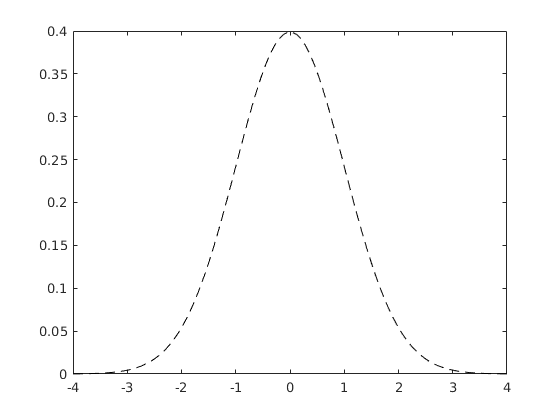
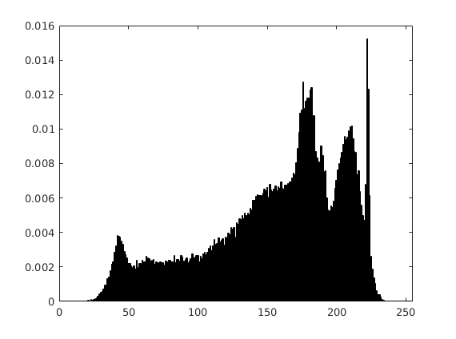
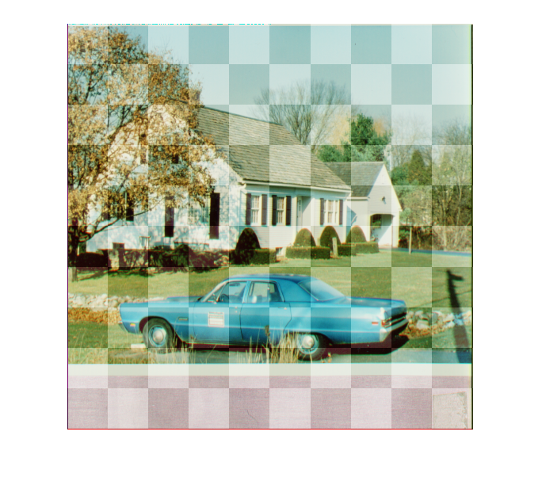

===============
Getting Started
===============

This *reStructuredText* document introduces the basic tools needed to complete the digital image processing assignments in `TDT4195`_ using MATLAB.

Make sure that the `Image Processing Toolbox`_ is installed.

If you want to try out the code snippets yourself, please copy and paste the relevant code blocks.

Arrays
======

Array construction
~~~~~~~~~~~~~~~~~~

There are several ways to construct arrays in MATLAB. Two common ways are: (i) create them from scratch and (ii) create vectors and matrices of all zeros, ones, or a constant value.

Here we create an array using the standard MATLAB syntax:

.. code-block:: matlab

  [1, 2, 3, 4, 5, 6, 7, 8, 9]

.. code-block:: bash

  1     2     3     4     5     6     7     8     9

All numeric arrays are, by default, of type ``double``.

.. code-block:: matlab

  v = [1, 2, 3, 4, 5, 6, 7, 8, 9];
  whos v

.. code-block:: bash

  Name      Size            Bytes  Class     Attributes
  v         1x9                72  double

It is possible to change the data type by casting the array, for example:

.. code-block:: matlab

  v = [1, 2, 3, 4, 5, 6, 7, 8, 9];
  v = int8(v);
  whos v

.. code-block:: bash

  Name      Size            Bytes  Class     Attributes
  v         1x9                72  int8

Below are several examples where arrays are created using the ``zeros``, ``ones``, and ``repmat`` functions. Each is created by specifying the shape of the output array. In ``zeros`` and ``ones`` the first and second element are the number of rows and columns, respectively. For ``repmat`` the first element is the number to be repeated.

.. code-block:: matlab

  zeros(1,3)

.. code-block:: bash

  0     0     0

.. code-block:: matlab

  zeros(3,1)

.. code-block:: bash

  0
  0
  0

.. code-block:: matlab

  ones(3,3)

.. code-block:: bash

  1     1     1
  1     1     1
  1     1     1

.. code-block:: matlab

  repmat(4, 5, 5)

.. code-block:: bash

  4     4     4     4     4
  4     4     4     4     4
  4     4     4     4     4
  4     4     4     4     4
  4     4     4     4     4

The ``eye`` function can be used to create an arbitrary identity matrix.

.. code-block:: matlab

  eye(4)

.. code-block:: bash

  1     0     0     0
  0     1     0     0
  0     0     1     0
  0     0     0     1

It is also possible to create an array with random values:

.. code-block:: matlab

  rand(3,4)

.. code-block:: bash

  0.9649    0.9572    0.1419    0.7922
  0.1576    0.4854    0.4218    0.9595
  0.9706    0.8003    0.9157    0.6557

Array indexing
~~~~~~~~~~~~~~

Accessing array elements in MATLAB is done using the following syntax: ``x(i)``. Keep in mind that MATLAB is 1-based, which means that indexing starts from ``1``. Let's create a vector and a matrix and see how it can be indexed.

.. code-block:: matlab

  vec = [1,2,3,4,5,6]

.. code-block:: bash

  1     2     3     4     5     6

.. code-block:: matlab

  mat = [1,2,3,4;5,6,7,8;9,10,11,12]

.. code-block:: bash

  1     2     3     4
  5     6     7     8
  9    10    11    12

Each element can be indexed like this:

.. code-block:: matlab

  vec(5)  % Fifth element

.. code-block:: bash

  5

.. code-block:: matlab

  mat(3, 2)  % Third row, second column

.. code-block:: bash

  10

Notice that for matrices, the first element denotes the row, while the second denotes the column

Arrays can be sliced by using the following syntax: ``start:stride:stop``. For example:

.. code-block:: matlab

  vec(1:3)  % Only start and stop is used. Includes the element at the stop index

.. code-block:: bash

  1     2     3

.. code-block:: matlab

  vec(1:2:5)

.. code-block:: bash

  1     3     5

.. code-block:: matlab

  mat(2:3,3:4)

.. code-block:: bash

   7     8
  11    12

.. code-block:: matlab

  mat(1:2:3,1:2:3)

.. code-block:: bash

  1     3
  9    11

The ``end`` keyword can be used to index the last element in an array.

.. code-block:: matlab

  vec(end)

.. code-block:: bash

  6

.. code-block:: matlab

  mat(end)

.. code-block:: bash

  12

Basic operations
~~~~~~~~~~~~~~~~

.. code-block:: matlab

  simple_matrix = [1,2,3;4,5,6;7,8,9]

.. code-block:: bash

  1     2     3
  4     5     6
  7     8     9

A slew of useful information can be retrieved by using the ``whos`` keyword:

.. code-block:: matlab

  whos simple_matrix

.. code-block:: bash

  Name               Size            Bytes  Class     Attributes
  simple_matrix      3x3                72  double

The ``size`` function can be used to see the array shape.

.. code-block:: matlab

  size(simple_matrix)

.. code-block:: bash

  3     3

The ``ndims`` function can be used to see the number of dimensions.

.. code-block:: matlab

  ndims(simple_matrix)

.. code-block:: bash

  2

Arrays can be reshaped to some other shape using the ``reshape`` function. The function preserves columnwise ordering.

.. code-block:: matlab

  reshape(simple_matrix, 9, 1)

.. code-block:: bash

  1
  4
  7
  2
  5
  8
  3
  6
  9

An array can be transposed using either ``.'`` or the ``transpose`` function.

.. code-block:: matlab

  simple_matrix.'

.. code-block:: bash

  1     4     7
  2     5     8
  3     6     9

Pointwise operations are done using standard MATLAB arithmetic operators.

.. code-block:: matlab

  simple_matrix + 2

.. code-block:: bash

  3     4     5
  6     7     8
  9    10    11

.. code-block:: matlab

  simple_matrix * 2

.. code-block:: bash

   2     4     6
   8    10    12
  14    16    18

.. code-block:: matlab

  simple_matrix / 2

.. code-block:: bash

  0.5000    1.0000    1.5000
  2.0000    2.5000    3.0000
  3.5000    4.0000    4.5000

When both sides of the multiplication symbol is either a vector or a matrix, a matrix multiplication will occur.

.. code-block:: matlab

  twos = repmat(2, 3, 3);  % 3x3 matrix of all twos
  simple_matrix * twos

.. code-block:: bash

  12    12    12
  30    30    30
  48    48    48

To do pointwise multiplication with vectors and matrices you must use the ``.*`` operator.

.. code-block:: matlab

  twos = repmat(2, 3, 3);  % 3x3 matrix of all twos
  simple_matrix .* twos

.. code-block:: bash

   2     4     6
   8    10    12
  14    16    18

The pointwise operator ``.`` can be combined with other operators as well. For example, we can perform exponentiation by using ``.^``.

.. code-block:: matlab

  simple_matrix .^ 3

.. code-block:: bash

    1     8    27
   64   125   216
  343   512   729

To find the inner product between two 1-D vectors we need to use the ``dot`` function.

.. code-block:: matlab

  dot([1,2,3], [2,2,2])

.. code-block:: bash

  12

To find the outer product between two 1-D vectors we can do the following:

.. code-block:: matlab

  u = [1;2;1];
  v = [1;2;1];
  h = u * v.';
  h = h / 16

.. code-block:: bash

  0.0625    0.1250    0.0625
  0.1250    0.2500    0.1250
  0.0625    0.1250    0.0625

Array copy
~~~~~~~~~~

In MATLAB, all assignments result in new copies. For example:

.. code-block:: matlab

  a = [1,2,3,4,5];
  b = a;
  b(1,1) = 10;
  isequal(a, b)

.. code-block:: bash

  0

Basic plotting
==============

The plotting interface in MATLAB is fairly easy to get the hang of. Let's plot a basic line. The ``linspace`` function returns an array with evenly spaced values within an interval.

.. code-block:: matlab

  xs = linspace(0, 5, 5);  % 5 points between 0 and 5

  figure;
  plot(xs, xs);
  title('A line');
  xlabel('X');
  ylabel('Y');

Here is another example where we superimpose two sinusoidal curves.

.. code-block:: matlab

  xs = linspace(0, 4*pi, 100);  % 100 points between 0 and 4*pi
  ys_sin = sin(xs);
  ys_cos = cos(xs);

  figure;
  a1 = plot(xs, ys_sin);
  hold on;
  c1 = 'Sine';
  a2 = plot(xs, ys_cos);
  c2 = 'Cosine';
  xlim([0, 4*pi]);  % Limit what is displayed in the x direction
  legend([a1;a2], c1, c2);
  grid;

Arbitrary functions can be plotted. For example, the 1-D Gaussian:

.. code-block:: matlab

  sigma = 10;
  mu = 0;
  xs = linspace(-40, 40, 100);  % 100 points between -40 and 40
  ys = exp(-(xs-mu).^2 / (2*sigma.^2));
  ys = ys / (sigma*sqrt(2*pi))

  figure;
  plot(xs, ys);
  xlim([-40, 40]);

Loading and saving images
=========================

Loading and saving of images are done using the ``imread`` and ``imwrite`` functions.

Images as arrays
================

Now that we know how to load images, let's load an image and display it using MATLAB.

.. code-block:: matlab

  image = imread('./house.tiff');

  figure;
  imshow(image);

Seeing as we've loaded the image in a regular MATLAB array, we can use everything we learned above to modify it. For example, let's try to transform it using the natural logarithm.

.. code-block:: matlab

  imagelog = double(image);
  c = 255 / log(max(max(max(max(imagelog))))+1);  % Scaling
  imagelog = c * log(imagelog+1);
  imagelog = uint8(imagelog);

  figure;
  imshow(imagelog);

A simple colour image consists of three so-called colour channels: red, green, and blue. This means that ``image`` is in fact a three-dimensional array with the following shape:

.. code-block:: matlab

  size(image)

.. code-block:: bash

  512   512     3

The first and second axis are the rows and columns respectively, while the last axis is the number of channels. The channels can be operated on separately. The following exemplifies how each channel can be plotted on its own using subplots:

.. code-block:: matlab

  r = image(:, :, 1);
  g = image(:, :, 2);
  b = image(:, :, 3);

  a = zeros(size(image, 1), size(image, 2));

  figure;
  subplot(1,3,1);
  imshow(cat(3, r, a, a));
  subplot(1,3,2);
  imshow(cat(3, a, g, a));
  subplot(1,3,3);
  imshow(cat(3, a, a, b));

With this in mind we can try to rearrange the colour channels to BGR instead of RGB.

.. code-block:: matlab

  rearranged(:, :, 1) = b;
  rearranged(:, :, 2) = g;
  rearranged(:, :, 3) = r;

  figure;
  imshow(rearranged);

Seeing as images are just regular MATLAB arrays, we can index them just like we did above. For example, we can inspect a pixel intensity in a greyscale image like this:

.. code-block:: matlab

  grey = image(:, :, 1);  % Let's assume that the red channel is a greyscale image
  grey(101, 41)

.. code-block:: bash

  188

When inspecting pixel intensities in a colour image, it is important to note that there are three values instead of one value.

.. code-block:: matlab

  image(101, 41, :)

.. code-block:: bash

  188
  193
  156

Image histogram
~~~~~~~~~~~~~~~

An image histogram is a representation where we count up the number of times an intensity occurs in an image. Using basic probability, we can normalise the image histogram to get an estimate of the probability of any intensity level occurring in the image. The following code snippet visualises an image histogram for a greyscale image:

.. code-block:: matlab

  [hist, bins] = imhist(grey);

  % Normalise
  pixel_count = prod(size(grey));  % Equivalent to numel(grey)
  hist = hist / pixel_count;

  bar(bins, hist);
  xlim([0, 255]);

It is also possible to create a colour image histogram by superimposing three histograms, one for each colour channel.

.. code-block:: matlab

  [red_hist, x] = imhist(r);
  [green_hist, x] = imhist(g);
  [blue_hist, x] = imhist(b);

  % Normalise
  pixel_count = prod(size(grey));
  red_hist = red_hist / pixel_count;
  green_hist = green_hist / pixel_count;
  blue_hist = blue_hist / pixel_count;

  plot(x, red_hist, 'Red', x, green_hist, 'Green', x, blue_hist, 'Blue');
  xlim([0, 255]);

Simple thresholding
~~~~~~~~~~~~~~~~~~~

Arrays can be indexed using a mask of boolean values. For example:

.. code-block:: matlab

  grey > 128;

With this in mind, we can easily do thresholding on an image if we have a threshold value. In this example, all pixel intensities above 128 will be set to 255, while all other pixel intensities are set to 0. Notice how the image is indexed using the boolean mask created by the threshold.

.. code-block:: matlab

  threshold = 128;
  thresholded_image = zeros(size(grey));
  thresholded_image(grey > threshold) = 255;

  figure;
  subplot(1,2,1);
  imshow(grey);
  subplot(1,2,2);
  imshow(thresholded_image);

.. image:: images/thresholded.png

MATLAB can display binary images as well.

.. code-block:: matlab

  binary_image = grey > threshold;

  figure;
  imshow(binary_image);

Image traversal
~~~~~~~~~~~~~~~

Knowing how to traverse an image in scanline will be quite useful for the assignments. Traversing an image in scanline means that we inspect each pixel, row by row. Below is an example, where every other pixel, in the previously used colour image, is set to black.

.. code-block:: matlab

  img = double(image) / 255;
  new_image = zeros(size(image));

  for y=1:size(new_image, 1)
    for x=1:size(new_image, 2)
      % Do something for each pixel here
      if mod(y, 2) == 0 && mod(x, 2) == 0
        new_image(y, x, :) = img(y, x, :);
      end
    end
  end

  figure;
  imshow(new_image);

Image Processing Toolbox
~~~~~~~~~~~~~~~~~~~~~~~~

The `Image Processing Toolbox`_ implements a collection of image processing and computer vision algorithms. For example, we can use the Canny edge detector to isolate probable edges in a greyscale image.

.. code-block:: matlab

  edges = edge(grey, 'Canny', [0.1, 0.2], 'both', 2);

  figure;
  imshow(edges);

Here is another example where we use the Harris & Stephens corner detector to identify probable corners. These may be used for further analysis of the image.

.. code-block:: matlab

  harris = detectHarrisFeatures(grey);
  corners = harris.selectStrongest(100);

  figure;
  imshow(grey);
  hold on;
  plot(corners);

.. Links

.. _TDT4195: https://www.ntnu.edu/studies/courses/TDT4195/
.. _Image Processing Toolbox: https://www.mathworks.com/products/image/
